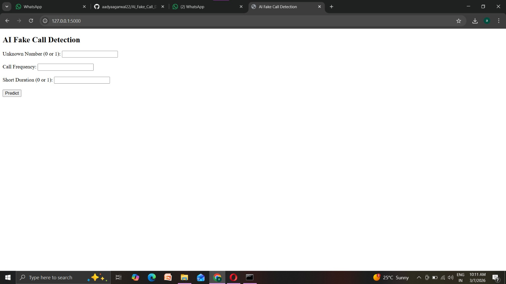
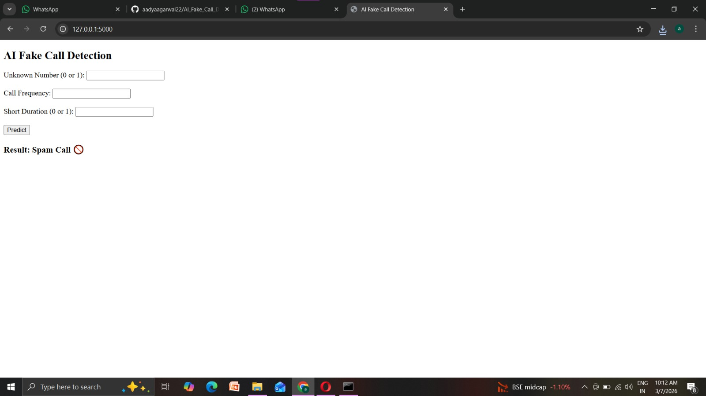
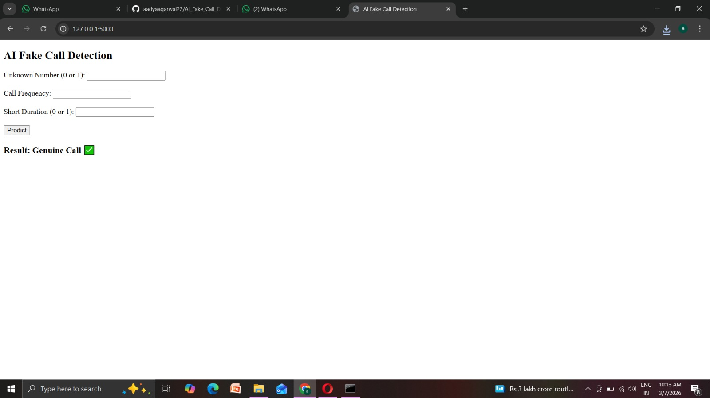

# 📞 AI Fake Call Detection

An AI-powered system that detects whether a phone call is **Spam** or **Genuine** using Machine Learning and a Flask web application.
## 📷 Application Interface

## 🚨 Spam Call Prediction

## ✅ Genuine Call Prediction

## 🎥 Project Demo
[Watch Demo Video](demo.mp4.mp4)
